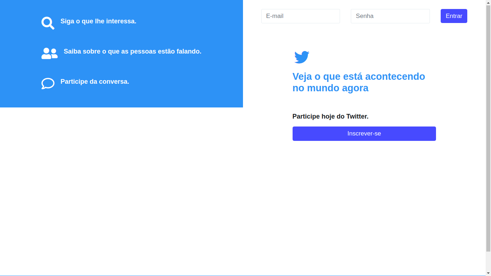
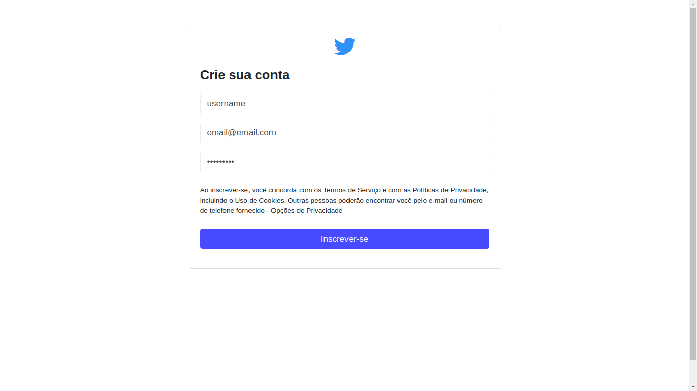
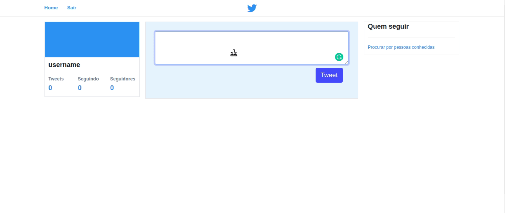
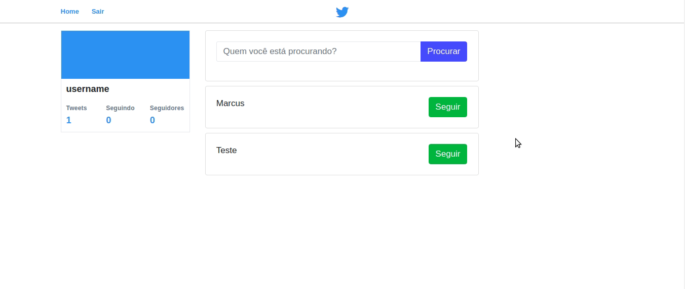

# Bem vindo ao Twitter Clone

## Crie uma conta

## E se divirta!

### Você também pode seguir outros usuarios, e ver o que eles andam postando

## Para instalar é bem simples, basta colar os comando abaixo no seu terminal
~~~
git clone https://github.com/MarcusXavierr/twitter-clone.git
~~~

### P.S.:Para usar o twitter-clone na sua máquina é preciso colocar as informações de login do seu banco de dados no arquivo App/Connection.php

## E para iniciar é só usar este comando aqui

~~~
cd twitter-clone/public && php -S localhost:8080
~~~

